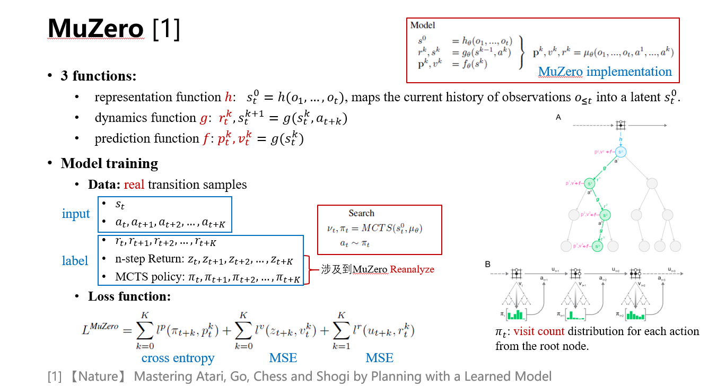
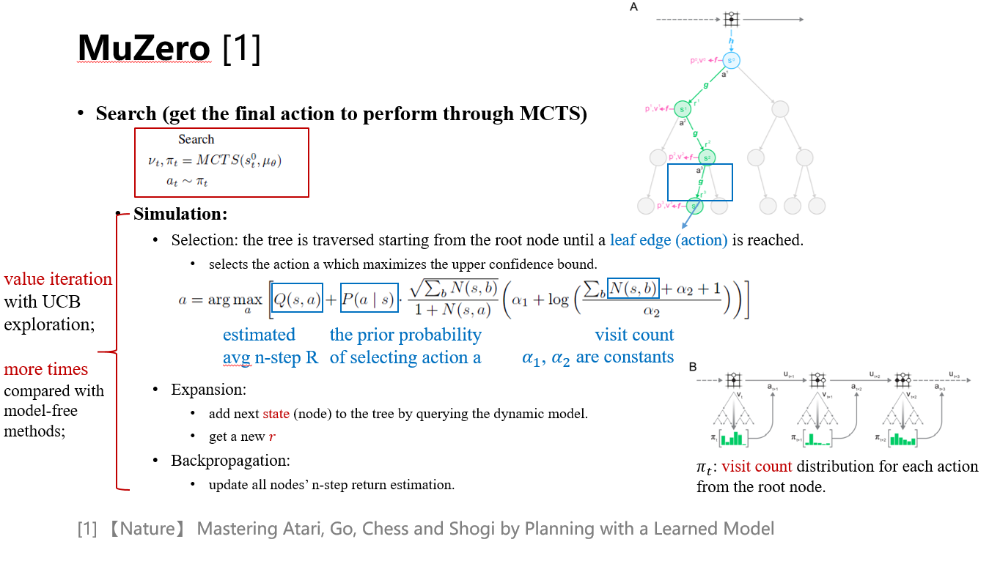
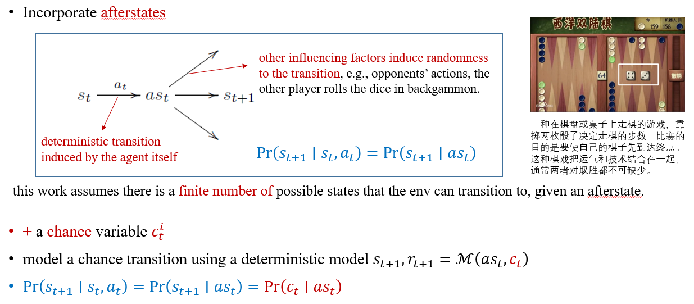
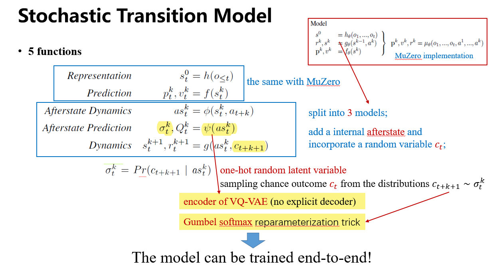
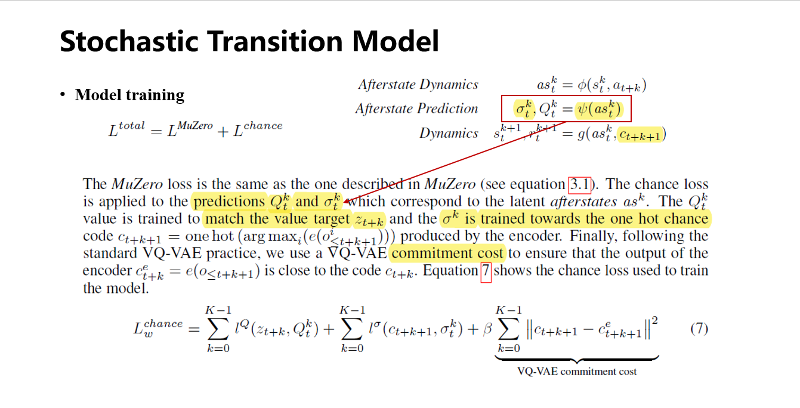
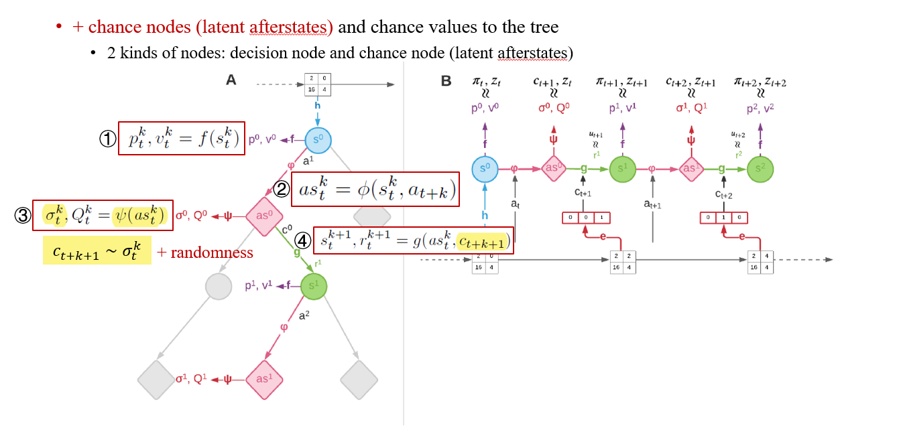
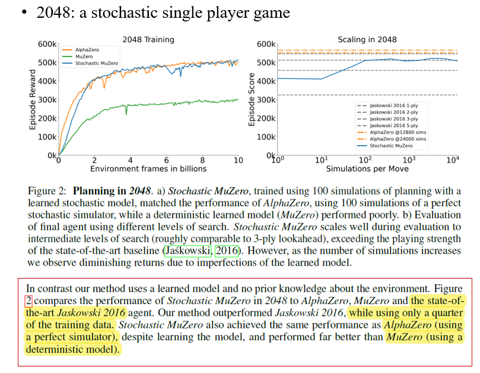
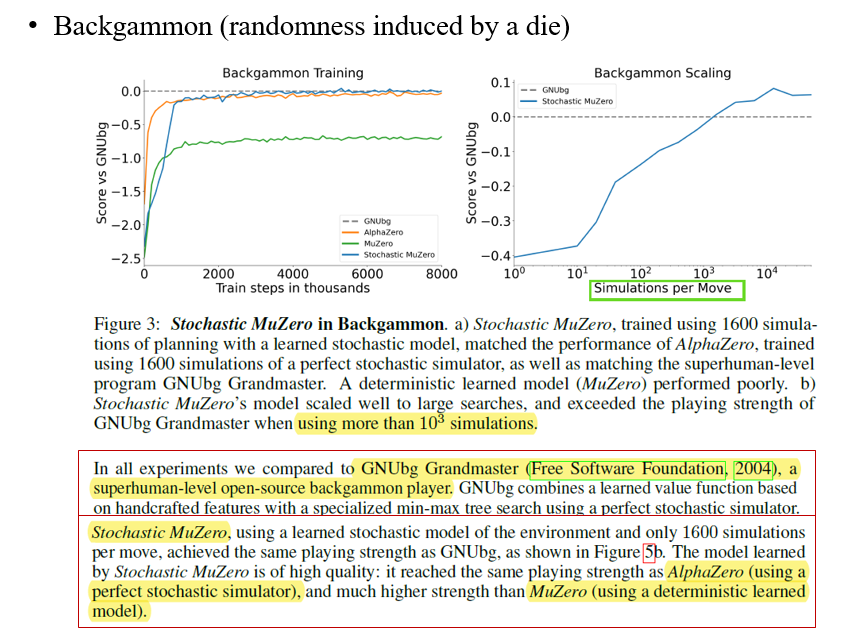
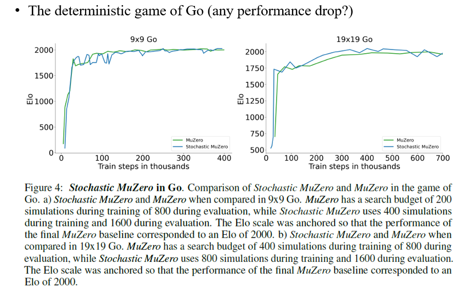

# 论文分享：Planning in Stochastic Environments with a Learned Model (ICLR 2022 Spotlight) 

## 一、动机

MuZero在多个领域的控制任务上取得了SOTA的表现，然而

- Previous ~~model-based methods~~ *MuZero* is limited to a deterministic class of dynamic models.

- Many environments are inherently stochastic and may be poorly approximated by a deterministic model.

因此，本文将 *MuZero* 拓展为*Stochastic* *MuZero*；原文链接：https://openreview.net/forum?id=X6D9bAHhBQ1

## 二、MuZero

### 2.1 Model Training

### 2.2 Search

## 三、*Stochastic* *MuZero*

### 3.1 Stochastic Transition Model

### 3.2  Stochastic Search

## 4. 实验

实验分3部分，（1）首先在single agent带有随机性的环境中，验证了*Stochastic* *MuZero*性能远超过使用deterministic model建模的MuZero，并且能够逼近使用perfect simulator的AlphaZero；（2）其次在2-player的西洋双陆棋（随机性：通过掷色子决定下一步能走的步数）也验证了与（1）相同的结论；（3）最后在deterministic的围棋环境中验证了：针对deterministic的环境，*Stochastic* *MuZero*虽然采用stochastic dynamic model建模，但其性能不亚于采用deterministic model建模的Muzero，即stochastic dynamic model的引入没有造成额外的performance drop。

